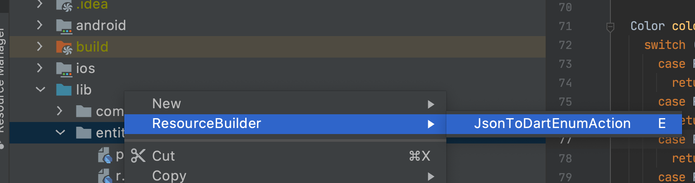
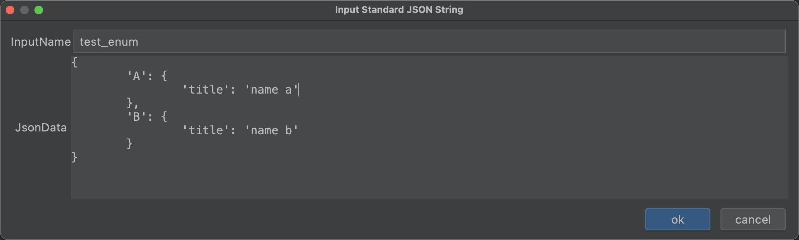

# README #

## 注意

此插件运行环境为flutter2.0+

## 功能

1.	图片资源自动处理

此插件会自动解析flutter项目中的pubspec.yaml文件中的`flutter/assets`。比如：

	flutter:
		assets:
			- libs/module/app/res/images/

然后插件会自动在当前文件夹同级目录下生成一个x-res.dart文件，自动关联资源文件生成静态变量。节省开发时间

2. 枚举代码生成

此插件可以帮助快速创建枚举类的代码生成

## 安装步骤 ##

1. 下载项目里的ResourceBuilder.zip

2. 打开Android Studio->setting->Plugins.

旧版点击

新版点击

选择你的**WorkSpace**/FlutterResourceBuilder/ResourceBuilder.zip

安装完成后重启Android Studio即可

## 使用

### 对于图片资源，只需要将文件放入assets指定目录就行。

### 对于枚举类生成器，可在项目任意代码文件目录下右键->ResourceBuilder->JsonToDartEnumAction

如下图所示

输入的json格式如下：

	{
		'A': {
			'title': 'name a',
			'color': 'ffffff'
		},
		'B': {
			'title': 'name b'
		}
	}

* json格式为jsonObject，不解析jsonArray。
* 只解析两层结构的json，第一层为枚举类型，第二层为扩展属性，超出的取缺省值null
* 扩展属性只解析dart的基本类型`String,bool,double,int`，其他类型取null
* 扩展属性取并集，缺省的返回null，如上json描述，A具有属性color，B没有，则枚举类型B的color属性为null

生成枚举类代码如下：

	///auto generate code, please do not modify;
	enum TestEnum {
       A,
       B,
       UNDEFINED,
	}
	
	class TestEnumUtils {
      static TestEnum build(String? value) {
        switch (value) {
          case 'A':
            return TestEnum.A;
          case 'B':
            return TestEnum.B;
          default:
            return TestEnum.UNDEFINED;
        }
      }
    }
	
	extension TestEnumEx on TestEnum {
      title() {
        switch (this) {
          case TestEnum.A:
            return 'name a';
          case TestEnum.B:
            return 'name b';
          case TestEnum.UNDEFINED:
            return null;
        }
      }
	
      color() {
        switch (this) {
          case TestEnum.A:
            return 'ffffff';
          case TestEnum.B:
            return null;
          case TestEnum.UNDEFINED:
            return null;
          }
      }
	
	  value() {
	    switch (this) {
	      case TestEnum.A:
	        return 'A';
	      case TestEnum.B:
	        return 'B';
	      case TestEnum.UNDEFINED:
	        return null;
	    }
	  }
	}

这样就可以在代码中轻松的使用枚举了。

	TestEnum enum = TestEnum.A;
	enum.title();//'name a'
	enum.color();//'ffffff'
	enum.value()://'A'
	TestEnum e = TestEnumUtils.build('A')'//TestEnum.A
	TestEnum undefined = TestEnumUtils.build('xx')'//TestEnum.UNDEFINED

>	由于客户端的版本是碎片化的，我们不能总是强制用户升级客户端版本。
> 所以在对接api接口字段转枚举时，default条件只能返回null，返回任意定义类型
> 都可能造成bug，所以对于枚举类，我们内置了一个UNDEFINED类型，
> 这属于一个开发规范的建议，如果不需要，可以手动删除代码。