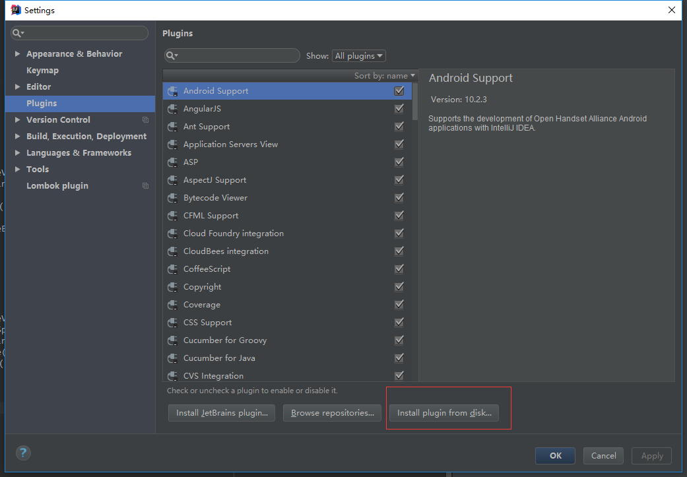
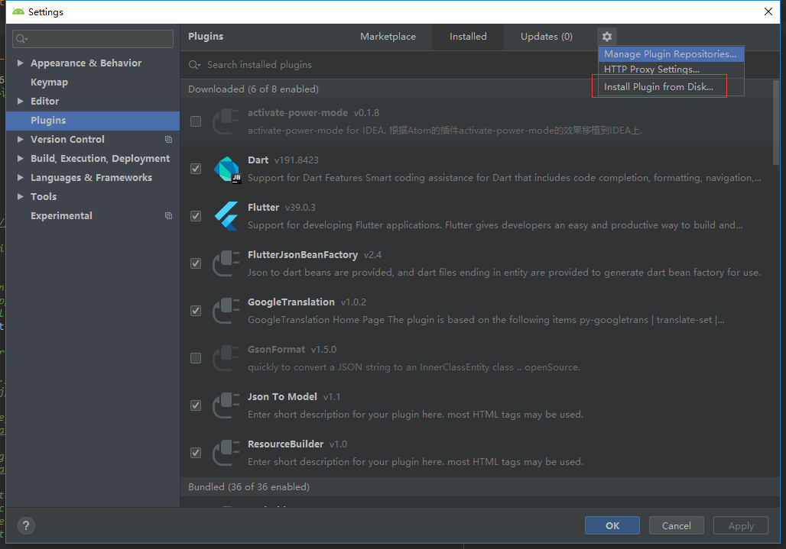
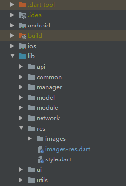
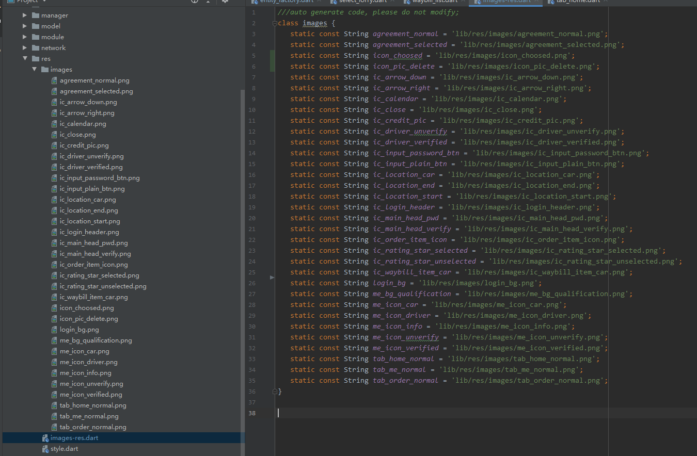

# README #

flutter中图片资源文件不像android原生那样，系统会生成**R.drawable/R.mipmap**的唯一标识来引用，也不像iOS原生那样可以直接使用路径引用。需要在pubspec.yaml中配置assets文件路径，为了方便开发最好还要编写一个class类声明路径方便调用。此插件就是为了解决这一没有技术含量的苦力活。

## 原理

此插件会自动解析flutter项目中的pubspec.yaml文件中的`flutter/assets`。比如：

	flutter:
		assets:
			- libs/module/app/res/images/

然后插件会自动在当前文件夹同级目录下生成一个x-res.dart文件，自动关联资源文件生成静态变量。

> 支持任意多个文件夹配置图片

## 安装步骤 ##

1. 拉取本项目到你的**WorkSpace**目录.

		git clone https://github.com/jianyuyouhun/flutter-plugin-resource-builder.git

2. 打开Android Studio->setting->Plugins.

旧版点击

新版点击

选择你的**WorkSpace**/FlutterResourceBuilder/ResourceBuilder.zip

安装完成后重启Android Studio即可

## 使用 ##

创建任意文件夹作为你的图片资源文件夹。比如`/lib/res/images`作为图片存放资源文件夹：

拖动图片到images文件夹下。会在images同级目录下生成一个images-res.dart文件。

在代码中使用

	import 'package:project/res/images-res.dart' as res;
	....

	Image.asset(
       res.images.ic_order_item_icon,
    ),
